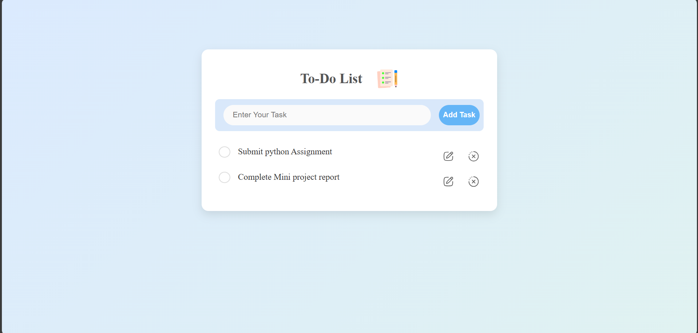

# 📝 To-Do List Web App

A clean, responsive, and minimalistic **To-Do List** web application built using **HTML**, **CSS**, and **JavaScript**. This app allows users to add, update, delete, and mark tasks as complete — with an enhanced user interface and modern design.

---

## 🌟 Features

- ✅ Add new tasks
- 📝 Update existing tasks
- ❌ Delete tasks
- ✔️ Mark tasks as completed
- 🎨 Stylish, responsive, and modern UI
- ⚙️ Smooth hover transitions and animations
- 💾 Inline editing with "Save" functionality

---

## 📸 Preview

---

## 🛠️ Tech Stack

- **HTML5** - Markup structure
- **CSS3** - Styling and layout (with transitions)
- **JavaScript** - Task logic (Add, Edit, Delete)

